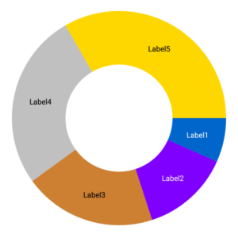
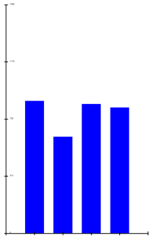
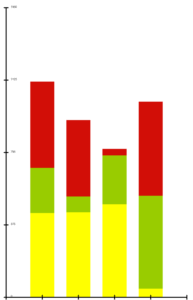
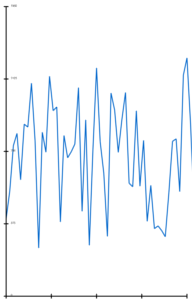
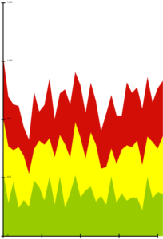
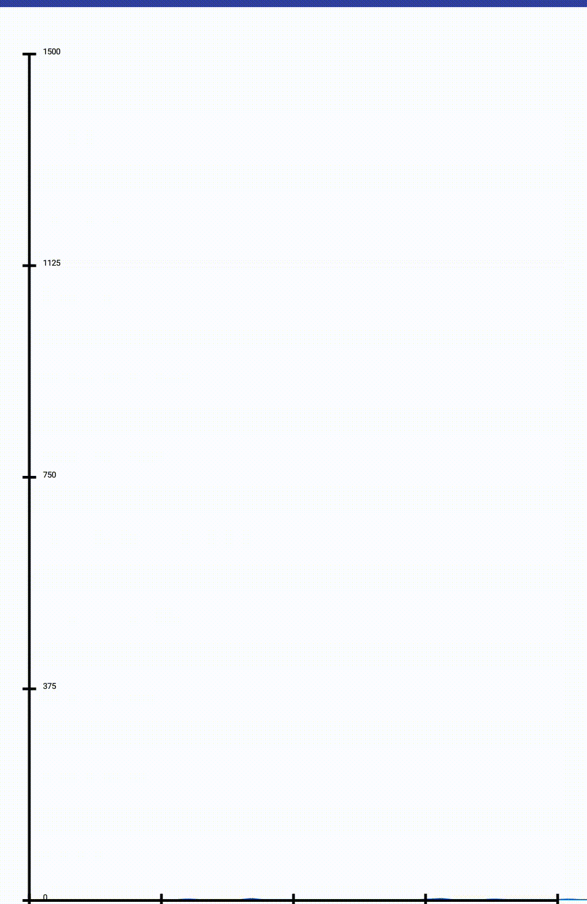
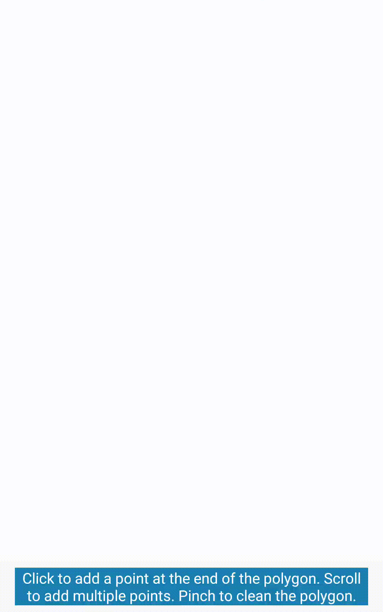

D3Android
=========

D3Android is a customizable Android library which allows to easily display live data. It is inspired by the javascript library D3.js.

## Usage
Add a D3View in your activity:
```
<com.applidium.pierreferrand.d3library.D3View
	android:id="@+id/d3view"
	android:layout_width="match_parent"
	android:layout_height="match_parent"
	/>
```

Then add the desired D3Drawable in your activity:
```
public class ExampleActivity extends Activity {

	 @Override protected void onCreate(@Nullable Bundle savedInstanceState) {
        super.onCreate(savedInstanceState);
        setContentView(R.layout.example_activity);

        D3View view = (D3View) findViewById(R.id.d3view);
        D3Drawable drawable = [...]

        view.add(drawable);
    }
}
```


## Usable classes
* [D3Arc](#d3arc)
* [D3Axis](#d3axis)
* [D3Barchart](#d3barchart)
* [D3StackBarchart](#d3stackbarchart)
* [D3BoxPlot](#d3boxplot)
* [D3Line](#d3line)
* [D3Area](#d3area)
* [D3Polygon](#d3area)

### D3Arc



It allows to draw pie charts. Examples can be found in CustomArcActivity and TurningArcActvity. In order to have a proper behavior, you have to specify:

* data (.data([...]) or in the constructor).

You should also specify:

* weights (.weight(_[...]_)), otherwise all arcs would have a weight of 1;
* inner radius (.innerRadiues(_[...])_), otherwise the inner radius would be 0;
* outer radius (.outerRadius(_[...]_)), otherwise the arc will take the maximum space;
* labels generation method (.labels(_[...]_)), otherwise the toString method would be used;
* offsets (.offsetX(_[...]_).offsetY(_[...]_)), otherwise they will value 0;
* padAngle (.padAngle(_[...]_)), otherwise all arcs would be separate by 1 degree;
* colors (.colors(_[...]_)); to custom used colors.

### D3Axis

It allows to draw axes. It is useful linked with another view to determinate coordinates of a point depending on its value. Examples can be found in MultipleAreasActivity, MultipleBarChartsActivity, BoxPlotActivity. You have to specify:

* the orientation (in the constructor), which determines if the axis is horizontal or vertical and if the legends are on the left/right (vertical) or top/bottom (horizontal) of the axis;
* the domain (.domain(_[...]_)) or in the scale), which determines the min and max value of the axis;
* the converter (.converter(_[...]_) or in the scale or by passing the class of the generic type in the constructor if it is a simple type such as Integer or Float) which is used to convert T (generic type) to float and float to T in order to allow scrolling and zooming and scaling.


You should also specify:

* the range (.range(_[...]_)) or in the scale). It is used to determine the screen coordinates of the min and max values. By default it goes from 5% of the screen to 95%;
* the offset (.offsetX(_[...]_).offsetY(_[...]_) or .translate(_[...]_)), otherwise the offsetX will be 0 for a horizontal axis and 5% of the view for a vertical axis, and the offsetY will be 0 for a vertical axis and 95% of the view for a horizontal axis;
* the labels generation method (.labelFunction(_[...]_)), otherwise the toString method would be used;
* the ticks (.ticks(_[...]_) or .ticksValues(_[...]_) or in the scale), otherwise there would be 5 ticks using the toString method.

### D3Barchart



It allows to draw bar charts. It works well used with a D3Axis. An example can be found in BarChartActivity. You have to specify:

* data (.data(_[...]_) or in the constructor);
* dataHeight (.dataHeight(_[...]_)), which determines the height of the bar for each data;
* x and y (.x(_[...]_).y(_[...]_)), which determines the coordinates of the origin of each bars.

You should also specify:

* dataWidth (.dataWidth([...])), otherwise each bar would have a width of 30 pixels.

### D3StackBarchart



It allows to draw stacked bar charts. Its behavior is very similar to D3BarChart's one. An example can be found in MultipleBarChartsActivity.

### D3BoxPlot


It allows to draw boxplots. It works well used with a D3Axis. An example can be found in BoxPlotActivity. You have to specify:

* data (.data(_[...]_) or in the constructor);
* dataMapper (.dataMapper(_[...]_)), which allows to map data to float in order to compute statistics;
* scale (.scale(_[...]_)), which allows to draw data correcty.

You should also specify:

* dataWidth (.dataWidth([...])), otherwise the boxplot would have a width of 50 pixels;
* offsetX (.offsetX([...])), otherwise it will be 0.

### D3Line



It allows to draw classical line charts. It works well used with two D3Axis. An example can be found in GrowingLineChartActivity. You have to specify:

* data (.data(_[...]_) or in the constructor);
* x and y (.x(_[...]_).y(_[...]_)), which determine the coordinates of each points.

### D3Area



It allows to draw area charts. Its behavior is very similar to D3Line's one. An example can be found in MultipleAreasActivity. You have to specify:

* data (.data(_[...]_) or in the constructor);
* x and y (.x(_[...]_).y(_[...]_)), which determine the coordinates of each points;
* ground (.ground(_[...]_)), which determines the coordinate of the bottom of the area.

### D3Polygon

It allows to draw polygons. An example can be found in DrawPolygonActivity and RectangleActionsActivity. You have to specify:

* coordinates (.x(_[...]_).y(_[...]_) or .coordinates(_[...]_) or in the constructor).


## General options

Some methods are defined in the D3Drawable class and give various options.

* Lazy recomputing (.lazyRecomputing(_[...]_)) determines either the Drawable is lazy or not. When the drawable is lazy will recompute its data only when it is asked for (.updateNeeded(_[...]_)). When it is not it will recompute all data each time it needs to be drawn. By default the drawable is lazy.
* Clip rectangle management (.setClipRect(_[...]_) or .deleteClipRect(_[...]_)) allows to limitate the draw of the drawable in a rectangle within the D3View. By default there is no clip rectangle.
* Actions (.onClickAction(_[...]_).onScrollAction(_[...]_).onPinchAction(_[...]_)) allow to set actions when the user interacts with the screen with a click/scroll/pinch.
* Paint (.paint(_[...]_)) allows to set the paint used when the Drawable must draw itself.

The D3View class has some options too.

* MinimumTimePerFrame (.setMinimumTimePerFrame_[...]_)) determines the minimum time in milliseconds between two frames. This allows to set the FPS. By default, the minimum time is 33 (30 FPS).


## Advice

* Call respectively view.onPause() and view.onResume() in the onPause and onResume methods of the activity to stop the view from computing when the activity is not in the foreground.
* When using a lazy drawable, call the updateNeeded method when the Drawable should refresh.
* Try to avoid allocations in the methods given to the drawables. They would be used each time the drawable needs to be redrawn (up to 60 times per second). Making a lot of allocations force the garbage collector to be called more often and can reduce the performances. For example use:
```
	new D3RangeFunction() {
		private float[] range = new float[2];

		@Override @Nullable public float[] getRange() {
			range[0] = [...]
			range[1] = [...]
			return range;
		}
	}
```
rather than:
```
	new D3RangeFunction() {

		@Override @Nullable public float[] getRange() {
			return new float[] {[...], [...]};
		}
	}
```
If you can, reuse objects rather than allocating new ones.
* If you use a version of Android with and API greater than 23, do not disable hardware acceleration in the activity to benefit for performance boosts.
* Use _view.getWidth()_ and _view.getHeight()_ where _view_ is a D3View to get proportionnal dimensions, for example:
```
	new D3FloatFunction() {
		@Override public float getFloat() {
			return view.getWidth() / 2F;
		}
	}
```
* You can customize the Paint used for each drawables by getting it (drawable.paint()), then by setting the desired properties or by using a pre-set paint (drawable.paint(_[...]_)).
* You can use ValueAnimators to create animations (see GrowingLineChartActivity).

## Examples






## License

```
Copyright 2017, Fabernovel Technologies
 *
 * Licensed under the Apache License, Version 2.0 (the "License");
 * you may not use this file except in compliance with the License.
 * You may obtain a copy of the License at
 *
 *     http://www.apache.org/licenses/LICENSE-2.0
 *
 * Unless required by applicable law or agreed to in writing, software
 * distributed under the License is distributed on an "AS IS" BASIS,
 * WITHOUT WARRANTIES OR CONDITIONS OF ANY KIND, either express or implied.
 * See the License for the specific language governing permissions and
 * limitations under the License.
 ``


